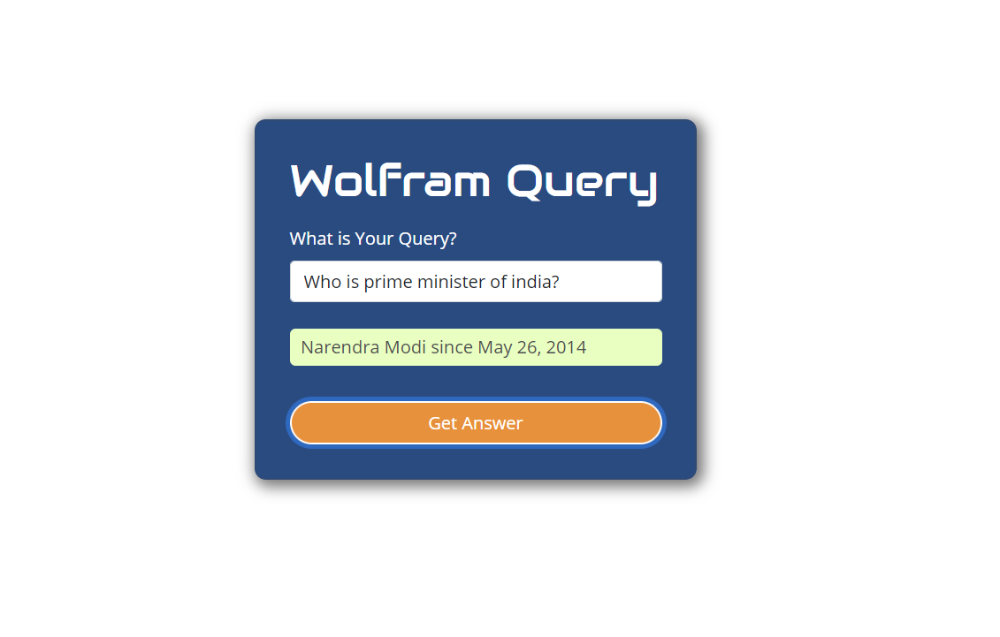
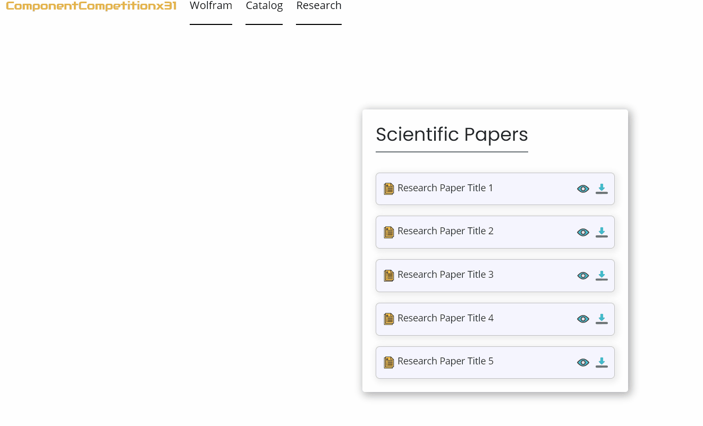
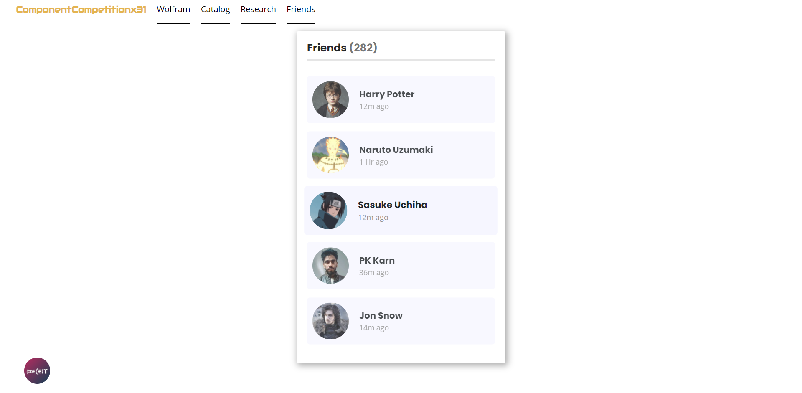
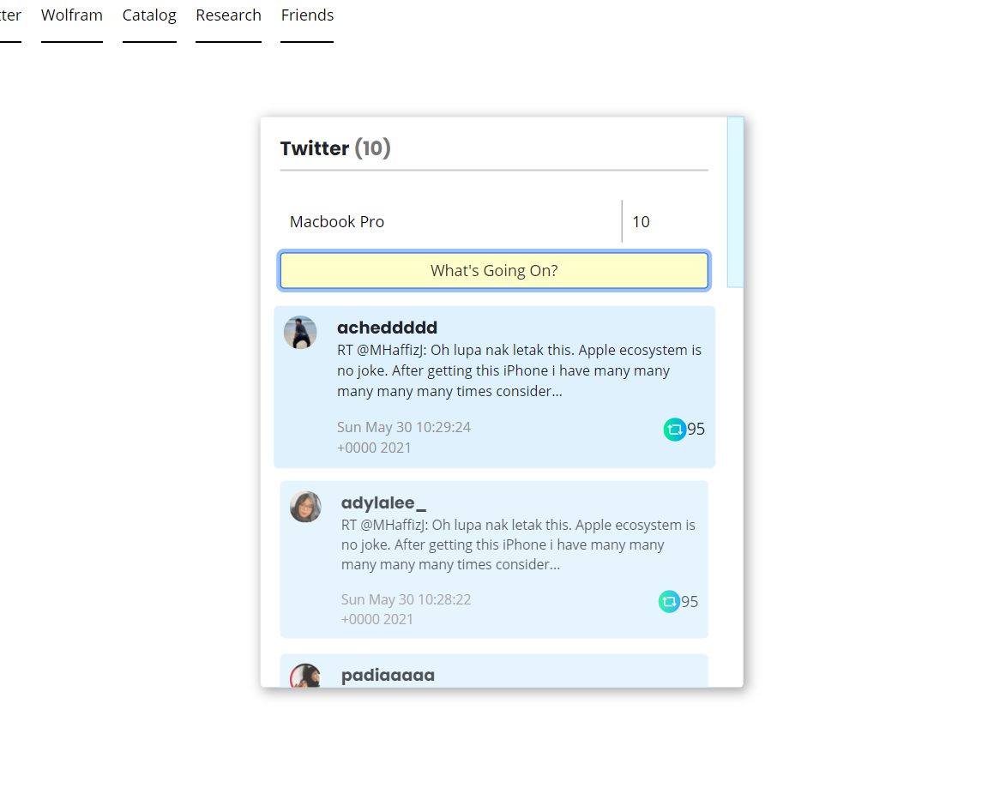
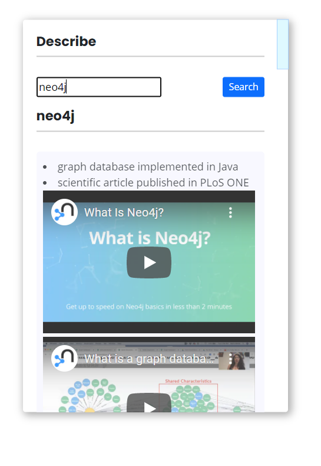
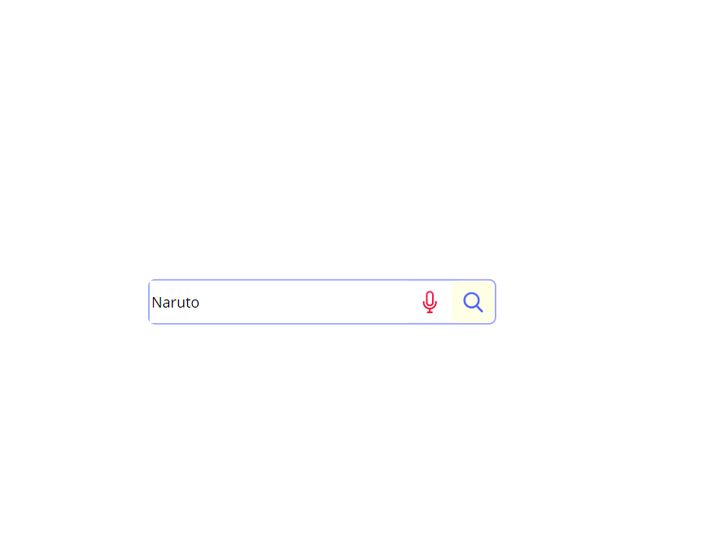
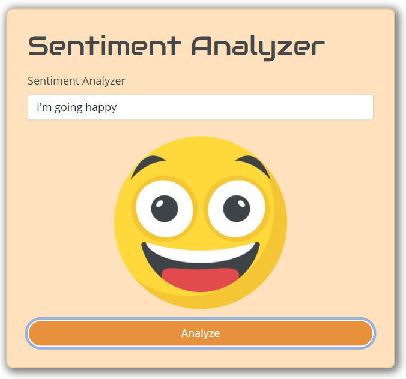
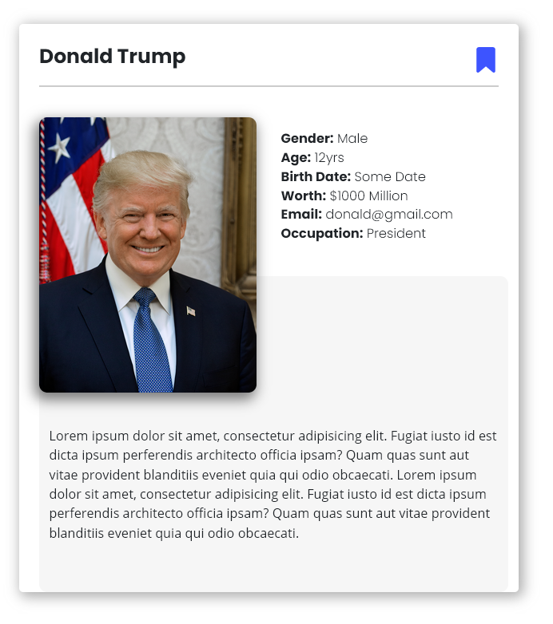

# How to install and run this Component

### Setup Express API

- **cd backend**
- **npm install** [To install required packages]
- **npm run start** [To run the server]

[Dont forget to add `.env` file before you're going to run this server]

{- Make sure server is running at :3000 port. Because as of now, I've only configured frontend part according to localhost:3000 -}

**Now left this server running** and change you directory to **frontend** folder

### Setup VueJS API

- **Open new terminal**
- **cd frontend/** [To change directory to frontend]
- **npm install**
- **npm run serve**

{+ Now this will run your app on localhost:8080 by default +}

**Wolfram Component**: Search Any Query, and you will get your answer

**Catalog Component**: Catalog Component just bare templated made with HTML, CSS, Bootstrap, SASS
**Research Component**: Research Component just bare templated made with HTML, CSS, Bootstrap, SASS

**Friends Component**: Friends Component just bare templated made with HTML, CSS, Bootstrap, SASS

**Twitter Component**: Twitter Component added - Made with HTML, CSS, Bootstrap, Express API, Twitter API, and

> Make sure to run Express API server before using this widget...

**Describe Component**: Describe Component added - Made with HTML, CSS, Bootstrap, Express API, Youtube API, and Wikidata API

> Make sure to run Express API server before using this widget...

**Search Component**: Search Component added - Made with HTML, CSS, Bootstrap, Annyang Liabrary

**Sentiment Component**: Sentiment Component added - Made with HTML, CSS, Bootstrap, Sentiment Liabrary

**Profile Widget**: Profile Component added - Made with HTML, CSS, Bootstrap

